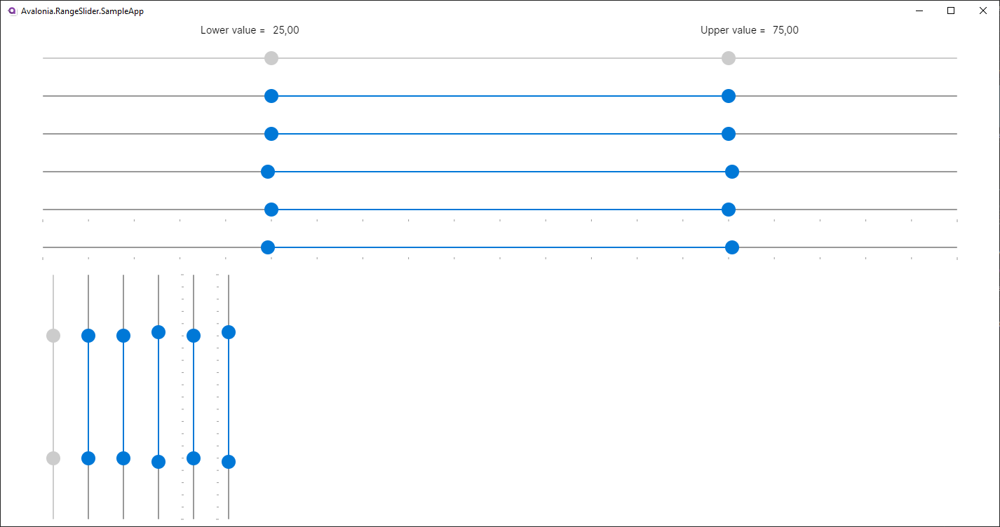

### About Avalonia.RangeSlider

---



---

For use:

1. Add style in App.xaml

```xml
<Application.Styles>
    ...
   <StyleInclude Source="avares://Avalonia.RangeSlider/Themes/RangeSlider.axaml"/>
</Application.Styles>

```

 For Material.Avalonia add

```xml
<Application.Styles>
    ...
   <StyleInclude Source="avares://Avalonia.RangeSlider/Themes/MaterialRangeSlider.axaml"/>
</Application.Styles>

```

2. Add RangeSlider in your window

```xml
 <Window
    ...
    xmlns:rs="using:Avalonia.RangeSlider.Controls"
    ...>
    
    <Grid>
       <rs:RangeSlider Minimum="0" Maximum="100" LowerSelectedValue="25" UpperSelectedValue="75" IsThumbOverlap="True"/>
    </Grid>
 </Window>
```

---

### License
Avalonia.RangeSlider is licensed under the [MIT license](LICENSE.md).