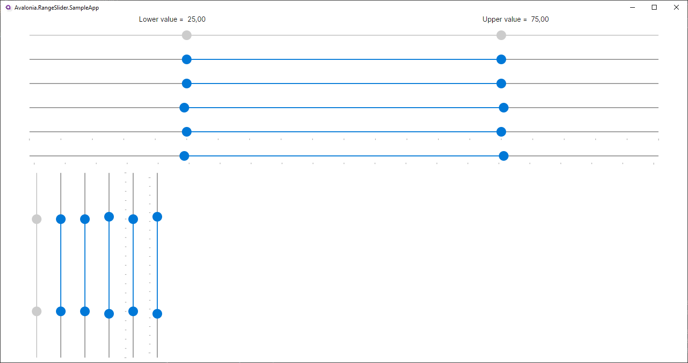

[nuget]: https://www.nuget.org/packages/RangeSlider.Avalonia


# RangeSlider.Avalonia

---



[][nuget]
[][nuget]

---

# Overview
This library provides a RangeSlider control with the following features:

- Orientation\
    RangeSlider support horizontal and vertical orientation

- IsSnapToTickEnabled\
    If set to true, thumbs will snap to ticks like in standard Slider

- IsThumbOverlap\
    If set to true, it allows the thumbs to overlap each other

    `IsThumbOverlap=True`\
    

    `IsThumbOverlap=False`\
    

- MoveWholeRange\
    If set to true, allows you to move the selected range as a whole by pulling the area between thumbs

    `MoveWholeRange=True`\
    

- TickBars and Tickplacement\
    RangeSlider support displaying/hiding ticks and change its ticks width according to minimum and maximum values changed

# Getting started

1. Add [RangeSlider.Avalonia][nuget] nuget package to your project:

        dotnet add package RangeSlider.Avalonia

2. Edit `App.xaml` file:

```xml
<Application ...
    xmlns:themes="using:RangeSlider.Avalonia.Themes.Fluent"
    ...>

	<Application.Styles>
		<themes:RangeSliderTheme />
	</Application.Styles>
	
</Application>
```

3. Add RangeSlider in your view

```xml
 <Window ...
    xmlns:rs="using:RangeSlider.Avalonia.Controls"
    ...>
    
    <Grid>
       <rs:RangeSlider Minimum="0" Maximum="100" LowerSelectedValue="25" UpperSelectedValue="75" IsThumbOverlap="True"/>
    </Grid>
 </Window>
```

---

### License
RangeSlider.Avalonia is licensed under the [MIT license](LICENSE.md).